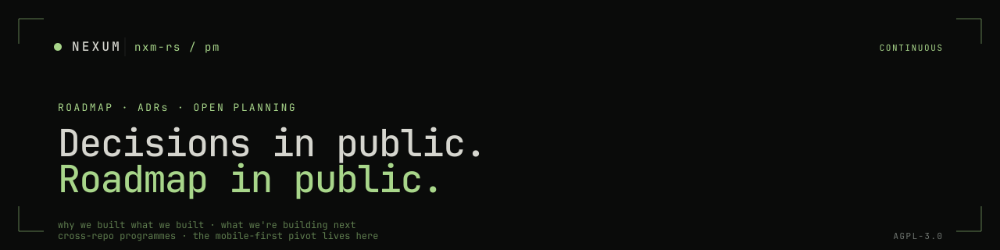

<p align="center">
  
</p>

Cross-repo planning for [nxm-rs](https://github.com/nxm-rs). Architecture Decision Records and quarterly roadmaps.

We plan in the open. There's no private Notion, no private Linear. If a decision matters across repos, it lands here so future readers — and future us — can see *why* the code looks the way it does.

> Looking for the org overview? See **[github.com/nxm-rs](https://github.com/nxm-rs)**.

---

## What's here

```
pm/
├── adr/         ← Architecture Decision Records · the why behind non-obvious choices
└── roadmap/    ← Quarterly plans (YYYY-QX.md format) + TEMPLATE.md
```

### `adr/` — Architecture Decision Records

For decisions that have lasting impact on how the codebase is shaped, and that would be opaque to a future reader without context.

- **Status** — Proposed / Accepted / Deprecated / Superseded
- **Context** — Why we needed to decide
- **Decision** — What we decided
- **Consequences** — What that means going forward

Write an ADR when the trade-off is non-obvious or the alternative was tempting. Don't write an ADR for style preferences (linters), temporary workarounds (TODO comments), or obvious choices.

### `roadmap/` — Quarterly plans

One file per quarter. Theme, ≤3 goals (outcome-focused), key deliverables organised by product, success metrics, and an explicit "what we're NOT doing" section. Plans change when reality hits — we revise in the open rather than pretending we knew all along.

---

## Working principles

- **Ship working code.** A working implementation beats perfect planning.
- **Plan in quarters.** Longer horizons are unreliable; shorter ones miss strategic shifts.
- **Outcomes, not features.** "Users can sign with a Keycard on Android" — not "ship Keycard pairing UI".
- **Decisions in public.** If it's load-bearing across repos, the *why* lives here.
- **No process theater.** Kill processes that don't help ship better code.

---

## Issue conventions

The label system is shared across all nxm-rs repos (see [.github](https://github.com/nxm-rs/.github)):

- **Priority** — `p0-fire`, `p1-broken`, `p2-annoying`, `p3-maybe`
- **Status** — `blocked`, `investigating`, `pr-welcome`
- **Type** — `bug`, `feature`, `dx`, `perf`, `debt`, `docs`
- **Effort** — `effort/minutes`, `effort/hours`, `effort/days`, `effort/weeks`

This repo's templates cover **Epics** (work too big for one PR — problem statement, success criteria, sub-tasks, non-goals) and **Milestones** (quarterly/release-based; 3–5 key deliverables, linked epics, risks).

---

## License

The roadmaps, ADRs, and templates are licensed under [AGPL-3.0-or-later](./LICENSE) consistent with the rest of the org. Forks of the planning process are welcome.
